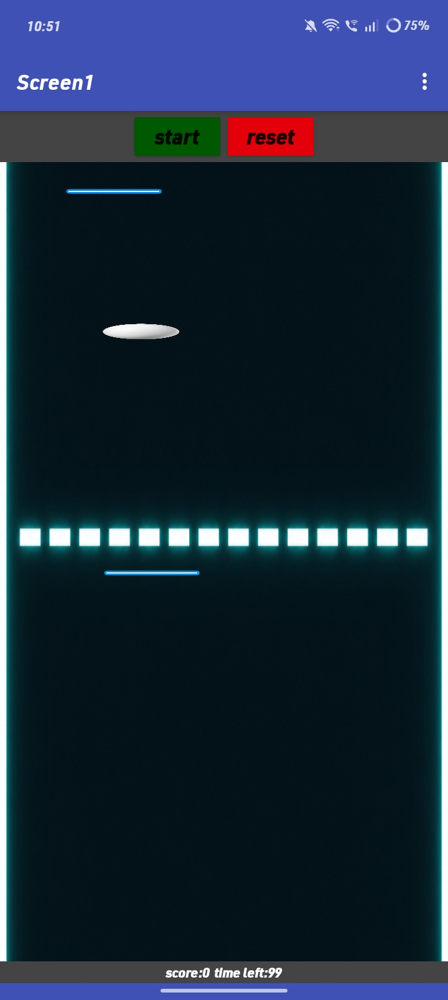

# Pong Game 🏓

A single-screen Android app, built with **MIT App Inventor**, that recreates the classic Pong game — bounce a ball off walls and a paddle, and rack up points when it slips past the opponent's edge.

## How it works

1. On launch, the ball is placed at a starting position and set moving at a fixed heading and speed
2. A `Clock` timer continuously moves the ball across the canvas
3. The ball bounces off the top/bottom edges and off the paddle when it collides with it
4. Drag your finger on the canvas to move the paddle and intercept the ball
5. If the ball reaches the left or right edge without being blocked, the opposing side's score increases
6. Scores are shown live on labels and update after every point

## Features

- 🏐 Continuous ball movement driven by a `Clock` timer
- 🧱 Wall bounce detection on ball edge collisions
- 🏓 Paddle bounce detection when the ball collides with `Paddle1`
- 🎮 Drag-to-move paddle control via `Canvas.Dragged`
- 🔢 Live score tracking for left and right sides, shown on labels
- 🔄 Game state reset (ball position, heading, speed, scores) on `Screen1.Initialize`

## Tech Stack

- **Platform:** MIT App Inventor (block-based, no native code)
- **Components:** `Canvas1`, `Ball1`, `Paddle1`, `Clock1`, `LabelLeftScore`, `LabelRightScore`
- **Variables:** `global LeftScore`, `global RightScore`

## How the Blocks Work

| Event | Action |
|---|---|
| `Screen1.Initialize` | Resets `LeftScore`/`RightScore` to 0, sets `Ball1`'s starting X/Y, heading (45°), and speed (5), and enables `Clock1` |
| `Clock1.Timer` | Calls `Ball1.Move` to advance the ball each tick |
| `Ball1.EdgeReached` (bounce) | If the ball hits the top or bottom edge, calls `Ball1.Bounce` |
| `Ball1.CollidedWith` | If the ball collides with `Paddle1`, calls `Ball1.Bounce` |
| `Canvas1.Dragged` | Moves `Paddle1` to follow the current drag position (`currentX`, `currentY`) |
| `Ball1.EdgeReached` (scoring) | If the ball reaches the right edge, increments `RightScore`; if it reaches the left edge, increments `LeftScore` — both update their labels |

## Example

| Action                  | Result                              |
|--------------------------|---------------------------------------|
| Ball hits top/bottom wall| Ball bounces back                     |
| Ball hits paddle         | Ball bounces back                     |
| Ball passes paddle       | Opposing score increases by 1         |
| Drag on canvas           | Paddle follows finger position        |

## Screenshot

*The blocks editor showing the Pong game's ball movement, bounce, scoring, and paddle drag logic.*

## Limitations (v1.0)

- Single paddle only — no dedicated second player paddle
- No game-over condition or win threshold for scores
- No difficulty scaling (ball speed stays constant)
- No sound effects on bounce or score

## Future Improvements

- Add a second paddle for two-player play
- Add a win condition (e.g. first to 10 points)
- Increase ball speed gradually as the rally continues
- Add sound effects and a restart/reset button

---
*Built as a mini project — MIT App Inventor, block-based development.*
